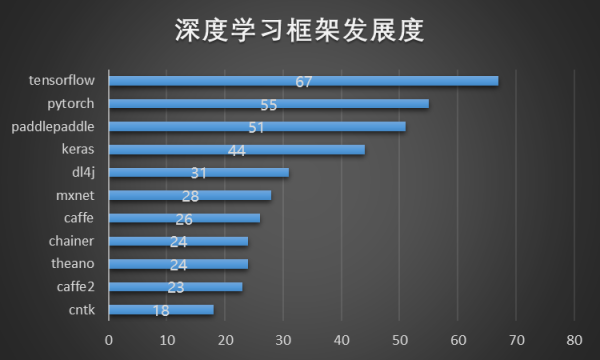

# 我们可以使用很多深度学习的API来实现一个卷积神经网络
> </img>
# 我们聚焦到pytorch,进入 https://pytorch.org/ 官网, 安装命令会告诉你如何安装
```bash

# 安装，此命令会同时安装cuda-toolkit安装包，相当方便
conda install pytorch torchvision cudatoolkit=10.1 -c pytorch

# 测试pytorc+cuda+cuDNN
import torch
print(torch.cuda.is_available())
# 如果显示True就表示可以使用电脑的GPU进行训练了

```

# 学习资源：如果你对神经网络足够感兴趣并且有动手实践的欲望，下边的教程就是你最好的入门老师
https://pytorch.org/tutorials/


