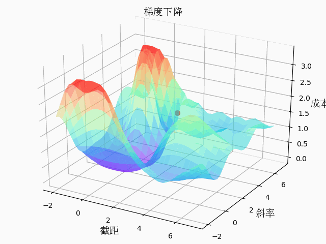

# 
简历

## 求职意向：图像/深度学习/机器人 算法工程师/研究员

张雷 
北京市海淀区厂洼街17号院1楼3门102, 100089 
86-186-1264-9130 
 
邮箱：2403613031@qq.com 
<a href="http://leirobot.com">个人网站</a> 
<a href="https://radiumray.github.io/">博客</a> 
<a href="https://github.com/radiumray/">GitHub</a> 
<a href="https://space.bilibili.com/482139222">B站</a> 

### 基本信息
> 性别：男，出生年月：1983年12月24日

### 教育背景，最高学历：硕士                                                              
> 2002.9 — 2006.7 	北京城市学院       软件工程（应用软件开发）
---
> 2006.10 – 2008.1      桑德兰大学, 桑德兰，英国    理学硕士 E-technology for business

### 工作经历
> 2004.10 – 2005.2月在 E 国电子商务 | 网站开发  
> 开发语言为：php, javascript, html 数据库为mysql
---
> 2008.9 – 2012.2 用友软件股份有限公司 | ERP生产制造工程师  
> NC流程制造开发部，参与过NC5.5，NC5.6，NC5.7，NC6.0中生产制造模块的开发。开发语言为Java, 主要客户是大型的有生产制造过程的企业或工厂，比如大冶摩托，河北邢台钢铁厂等。
---
> 2012.2 — 2012.12 北京海普赛思科技股份有限公司 | 软件工程师
---
> 2012.12 — 2014.4 世纪爱晚 | 项目产业部-经理
---
> 2014.4 — 至今 美科科技(北京)有限公司 | 嵌入式研发工程师

### 做过的项目
> 2018年至今
---
预研Opencv, tensorflow, keras开始做基于视觉的自动驾驶 
随后参考了donkeycar的方案，开发了用于大学生人工智能比赛用车 
最后自研基于实际道路的自动驾驶（yolo，centernet，leneNet），资料整理如下： 
<a href="https://github.com/radiumray/leirobot/blob/gh-pages/book/book.md">资料目录传送门</a> 
<a href="https://www.bilibili.com/video/av94599742/">相关视频传送门</a> 

> 同时也有如下实现案例
---
Opencv机器视觉读电表： 
通过HVS颜色分割，透视变换，匹配数码管读取电表读数课程 

全卷积神经网络热力图输出： 
手指尖精准定位与矫正聚焦（特征点热图定位DSNT，自知打标签工具） 

模型转换优化： 
模型优化用于嵌入式设备(onnx, tensorRT, ncnn 模型转换) 

物体检测追踪算法： 
人流量统计（centernet+deepSort） 

<a herf="https://www.bilibili.com/video/av94985729/">相关视频传送门</a> 

> 写了4节机器学习的课程，数学公式推导
---
数学公式推导，函数求导，损失函数，梯度下降，线性回归，python numpy实现，3d图动画展示梯度下降 
https://github.com/radiumray/ML

 

<a herf="https://space.bilibili.com/482139222/channel/detail?cid=111159">相关视频传送门</a> 

> 2016年至2018年
---
预研openMV，MT7688，树莓派，虚谷号 结合这些做相关应用，比如在ESP32和树莓派上写各种microduino传感器的库：<a href="https://github.com/radiumray/micropythonESP32">ESP32 micropython库</a>  <a href="https://github.com/radiumray/piSensorLib">树莓派python库</a>
ESP32的图传遥控车，用于自动驾驶，自动驾驶神经网络处理在另一台主机，图传给主机处理再发送指令给小车,freertos多线程c++开发

> 2014年至2016年
---
嵌入式相关开发工作，固件开发，应用开发，物联网，去各个大学培训老师和学生
基于各种模块对mixly进行二次开发：
https://github.com/radiumray/mdxly

> 2013年至2014年
---
基于microduino模块写wiki教程 <a href="https://wiki.microduino.cn/index.php/%E5%85%B6%E4%BB%96%E6%95%99%E7%A8%8B">维基教程地址</a> 这部分教程在大学里比较受欢迎
推荐作品：<a href="https://wiki.microduino.cn/index.php/Microduino_%E8%87%AA%E5%8A%A8%E5%AF%BC%E6%98%9F%E7%BB%8F%E7%BA%AC%E4%BB%AA/zh">自动导星经纬仪</a> <a href="https://wiki.microduino.cn/index.php/Microduino_%E5%85%89%E4%BC%A0%E8%BE%93%E8%8E%AB%E5%B0%94%E6%96%AF%E7%A0%81/zh">光传输莫尔斯码</a> <a href="https://wiki.microduino.cn/index.php/Microduino_%E7%94%B5%E7%A3%81%E7%82%AE/zh">电磁炮</a> <a href="https://wiki.microduino.cn/index.php/Microduino_%E8%A7%86%E9%A2%91%E8%BE%93%E5%87%BA/zh">视频输出</a> 
相关视频：
https://radiumray.github.io/2019/08/11/struggle/

> 嵌入式经验：
开发板：熟悉arduino及各种microduino模块,ESP8266,ESP32,K210，Linux系统应用开发
嵌入式开发语言：熟悉c,c++,python
通讯协议：UART，I2C，SPI，RS485，蓝牙，wifi，nrf24

> 自我评价
---
学习能力强，一直是喜欢研究，对未知的有意义的领域有欲望去探索，觉得人工智能是一个可以长期投入的领域，疫情期间在家自学UE4虚幻引擎C++开发，觉得可以和嵌入式硬件，物联网和人工智能相结合。

